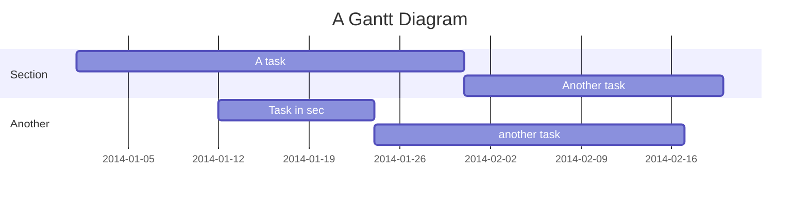

# Some Interesting Features

## Mermaid

## LaTeX Expressions

Center: $$x=\frac{-b\pm\sqrt{b^2-4ac}}{2a}$$

Inline: $x=\frac{-b\pm\sqrt{b^2-4ac}}{2a}$, $x=s_x + x_1$

Matrix:
$$\begin{matrix}
a&0&0\\\
0&1&0\\\
0&0&1\\\
\end{matrix}$$

## Tags

Tags can be used to sort notes. Click to search tags in all files:

#tag1 #tag2

Emoji can also be used in tags: #🌲 #📽️

## Internal Links

See preview by hovering on the link:

- Use `[[README]]` (supported by Obsidian): [[README]]
- Or `[README](README.md)` (Markdown-style link): [README](README.md)
- Unexisted files can also be linked to, click to create the file: [Unexisted](Unexisted.md)

The number of backlinks is displayed at the bottom-right of the Obsidian window. Click on it to see which notes have links to the current note.

## Youtube iframe

	<iframe width="560" height="315" src="https://www.youtube.com/embed/Ewhfok91AdE" frameborder="0" allow="accelerometer; autoplay; encrypted-media; gyroscope; picture-in-picture" allowfullscreen></iframe>

## TODO
The plugin `checklist` can help us collect todo items across pages into the sidebar.

#todo 
- [x] Checked todo
- [ ] Unchecked todo

#todo/software
- [ ] Explore Obsidian

Important settings for the plugin `checklist`:
- Group By
- Show Completed?