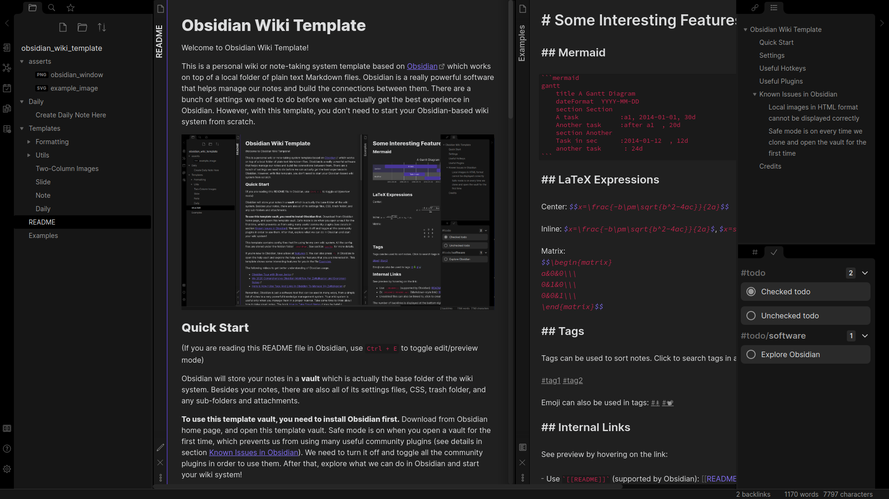
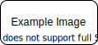
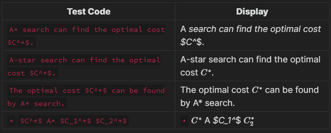

# Obsidian Wiki Template
Welcome to Obsidian Wiki Template!

This is a personal wiki or note-taking system template based on [Obsidian](https://obsidian.md/) which works on top of a local folder of plain text Markdown files. Obsidian is a really powerful software that helps manage our notes and build the connections between them. It is cross-platform (Windows, Linux, macOS) and free for personal use. There are a bunch of settings we need to do before we can actually get the best experience in Obsidian. However, with this template, you don't need to start your Obsidian-based wiki system from scratch.

(If you are reading this README file in Obsidian, use `Ctrl + E` to toggle edit/preview mode)



## Quick Start

Obsidian will store your notes in a **vault** which is actually the base folder of the wiki system. Besides your notes, there are also all of its config files, CSS, trash folder, and any sub-folders and attachments.

**To use this template vault, you need to install Obsidian first.** Download from [Obsidian](https://obsidian.md/) home page, and open this template vault. Safe mode is on when you open a vault for the first time, which prevents us from using many useful community plugins (see details in section [Known Issues in Obsidian](#Known-Issues-in-Obsidian)). We need to turn it off and toggle all the community plugins in order to use them. After that, explore what we can do in Obsidian and start your wiki system!

This template contains config files that I'm using for my own wiki system. All the config files are stored under the hidden folder `.obsidian`. See section [`Settings`](#Settings) for more details.

## Learn about Obsidian

If you're new to Obsidian, take a look at [features](https://obsidian.md/features). You can also press `F1` in Obsidian to open the help vault and explore the help vault for features that you are interested in.  This template shows some interesting features for you in the file [Examples](Examples.md). 

Watch the following videos to get better understanding of Obsidian usage.

- [Obsidian Tour with Bryan Jenks](https://www.youtube.com/watch?v=GurXxeaq68o)
- [My 2020 Comprehensive Obsidian Workflow For Zettelkasten and Evergreen Notes](https://www.youtube.com/watch?v=Ewhfok91AdE)
- [Here Is How I Use Tags And Links In Obsidian To Manage My Zettelkasten](https://www.youtube.com/watch?v=zIh1S7ra3aI)

Remember, Obsidian is just a software tool that can be used in many ways, from a simple list of notes to a very powerful knowledge management system. Your wiki system is useful only when you manage them in a proper manner. Take some time to think about how to take smart notes. The book [How to Take Smart Notes](https://takesmartnotes.com/) may be helpful.

## Settings

Besides our notes, all settings are stored under the folder `.obsidian` including built-in plugin settings, downloaded community plugins, workspace layouts, hotkeys, etc. Note that Obsidian has split `config` into multiple JSON files since v1.0. Let's take a look at what's inside this folder:

- `plugins/` is the folder contains downloaded community plugins.
- `workspace.json` maintains the latest workspace layout. You can treat it as the layout of the home page you would like to see when you open your vault in Obsidian. This file will be updated most frequently even you just open a new file and close Obsidian.
- `core-plugins-migration.json` stores the activation status of the built-in core plugins.
- `core-plugins.json` stores a list of activated core plugins in your vault (which are set `true` in `core-plugins-migration.json`).
- `community-plugins.json` stores a list of installed community plugins in your vault.
- `hotkeys.json` stores your custom hotkey configurations.
- Other settings, including settings for some activated core plugins, can be found at `app.json`, `appearance.json`, etc.

**Obsidian will update these files in sync, so if you don't want to frequently commit changes on these settings, you should update these files manually.** It is highly recommended to put the file `workspace.json` (and perhaps other config files as well) into `.gitignore` once you commit your favourite layout.

## Useful Hotkeys

Some useful hotkeys used in this template (customized means this is my personal setting):

| Hotkey names                                                 | Hotkey settings                      |
| ------------------------------------------------------------ | ------------------------------------ |
| Insert template                                              | `ctrl + T` (override New tab hotkey) |
| Search current file                                          | `Ctrl + F`                           |
| Search in all files                                          | `Ctrl + Shift + F`                   |
| Jump to file                                                 | `Ctrl + O`                           |
| Focus on pane to the left (only works for left-right split panes) | `Alt + <-` (customized)              |
| Focus on pane to the right (not working for left-right split panes) | `Alt + ->` (customized)              |
| Open command palette                                         | `Ctrl + P`                           |
| Toggle edit/preview mode                                     | `Ctrl + E`                           |
| Close active pane                                            | `Ctrl + W`                           |
| Emoji Toolbar: Open emoji picker                             | `Ctrl + [` (customized)              |
| Wikilinks to MDLinks: Toggle selected wikilink to markdown link and vice versa | `Ctrl + Shift + L`                   |
| Toggle bold for selection                                    | `Ctrl + B`                           |

- Opening a note with `Ctrl` key will open it in a new pane.
- `Shift + Scroll wheel` to scroll between all opened notes (only works in the pane with stacked tabs).
- Note that the hotkeys `Focus on Pane to the left/right` only works for left-right split panes. New built-in feature `Stack Tabs` just stack tabs in the same pane and thus these hotkeys doesn't work for them.


## Useful Plugins

This template uses the following built-in core plugins and community plugins:

- Core plugins (only the most useful ones are listed here)
  - Templates (use custom templates under `Templates` folder to reduce your efforts to take notes)
  - Daily notes (create or open today's daily note with only one click)
  - Slides (make fast presentation)
  - Graph view (explore connections between notes)
  - Quick switcher (use `Ctrl/Cmd + O` to jump to other files quickly)
  - Canvas (arrange and connect notes on an infinite canvas and save to `.canvas` files)
- Community plugins
  - Checklist (combines checklists across pages into user's sidebar)
  - Copy button for code blocks
  - Emoji Toolbar (find and input emoji quickly)
  - Wikilinks to MDLinks (very useful if you want to switch links between `[[link]]` and `[link](./path/to/file)`)

## Solutions to Known Issues in Obsidian

Even though Obsidian is a great choice for building a wiki system, it actually has some little issues to resolve.

### Local images in HTML format cannot be displayed correctly

We like the syntax `` because we can scale images more easily. In Obsidian, `` cannot be used to display local images. But it can still be used for online image (images in Github repo failed) . See the examples below.

```markdown

```


```markdown

```


```markdown

```


Solution is, we use table to help us arrange images. There is a template file named `Two-Column Images` which we can use to resize image to 50% width. This should work well in most cases.

```markdown
| Left | Right |
|-----|-----|
|![[example_image.svg]]||
```

| Left | Right |
|-----|-----|
|![[example_image.svg]]||

### A LaTeX field with `*` in it cannot be rendered properly if there is a star symbol `*` before it

If we use star symbol `*` in a LaTeX field like $C^*$, in the same paragraph there should not be any `*` symbol before it (it's okay to use star `*` in a code field before it), otherwise the LaTeX symbol cannot be rendered properly. See examples below.

| Test Code                                           | Display (See this part in Obsidian)               |
| --------------------------------------------------- | ------------------------------------------------- |
| `A* search can find the optimal cost $C^*$.`        | A* search can find the optimal cost $C^*$.        |
| `A-star search can find the optimal cost $C^*$.`    | A-star search can find the optimal cost $C^*$.    |
| `The optimal cost $C^*$ can be found by A* search.` | The optimal cost $C^*$ can be found by A* search. |
| `*` `$C^*$ A* $C_1^*$ $C_2^*$`                      | `*` $C^*$ A* $C_1^*$ $C_2^*$                      |



### Safe mode is on every time we clone and open the vault for the first time

Safe mode will be initialized to `ON` every time we clone and open the vault for the first time on a new PC, which will prevent us from using community plugins.

Solution is:

1. Back up `.obsidian/*.json` before we clone and open the vault for the first time. 
2. Open the vault and click `Trust author and enable plugins`. 
3. Restore these JSON files with backup. Everything will be exactly what it was, except for the window's location and size which are stored at a different path for the latest version, but this is okay since you will resize it on the new machine anyway.

Feel free to use the script `setup.sh` to help backup or restore on Linux (or on Windows with something like Git Bash that supports Shell scripts).

```bash
# Step 1: Back up (Run the script in the root directory of this repo)
./setup.sh backup

# Step 2: Open the vault and click `Trust author and enable plugins`.

# Step 3: Restore
./setup.sh restore

# See command instructions by
./setup.sh
./setup.sh -h
./setup.sh --help
```


## Credits

- **Shida Li** and **Erica Xu** for their excellent works on [Obsidian](https://obsidian.md/).
- **Bryan Jenks** for his wonderful and elaborated videos about how to take notes in Obsidian.